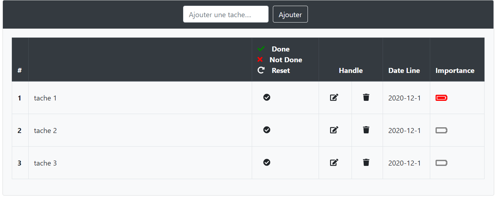
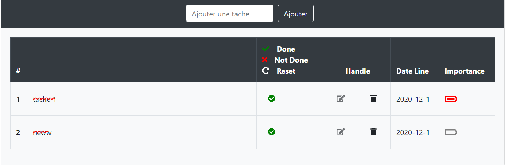
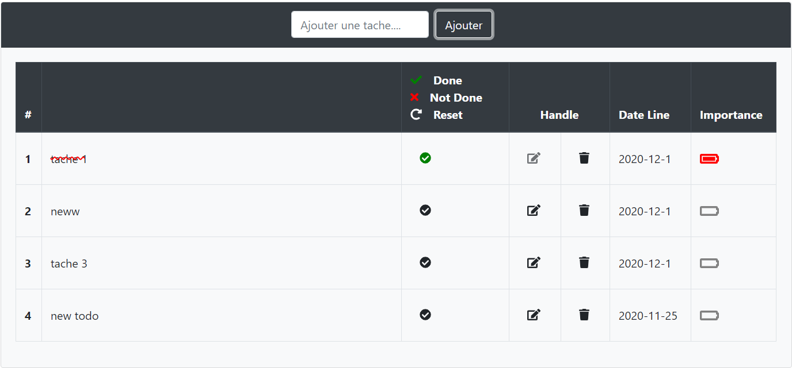
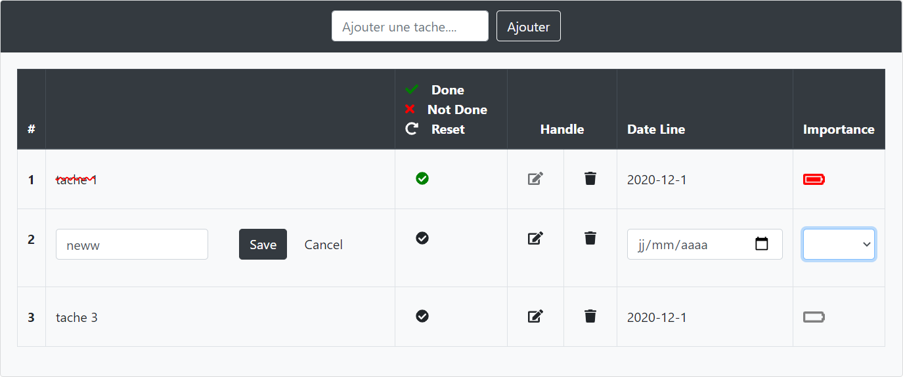
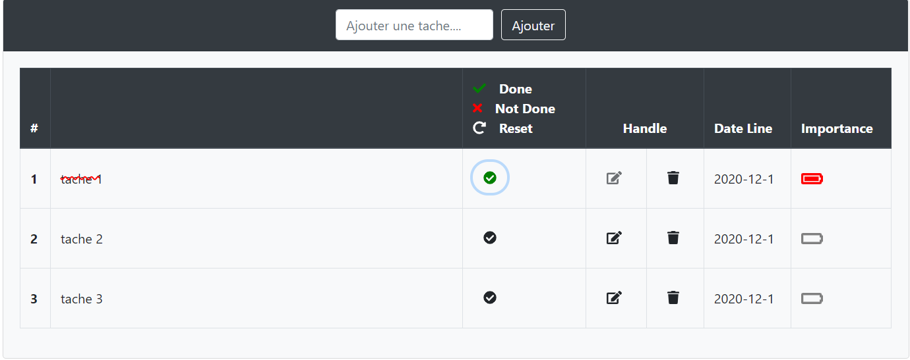

# Getting Started with Create React App
This is an application of a todolist with redux with filters that show only done todos and not done and can reset the todos list completed list . You can also add a new Todo or remove it or edit it. And you also can see the importance of each todo and the date line.

here is the list of our todos

here you can see the done list

you can also a new todo

or you can edit it

when a todolist is done there will be a line through it

